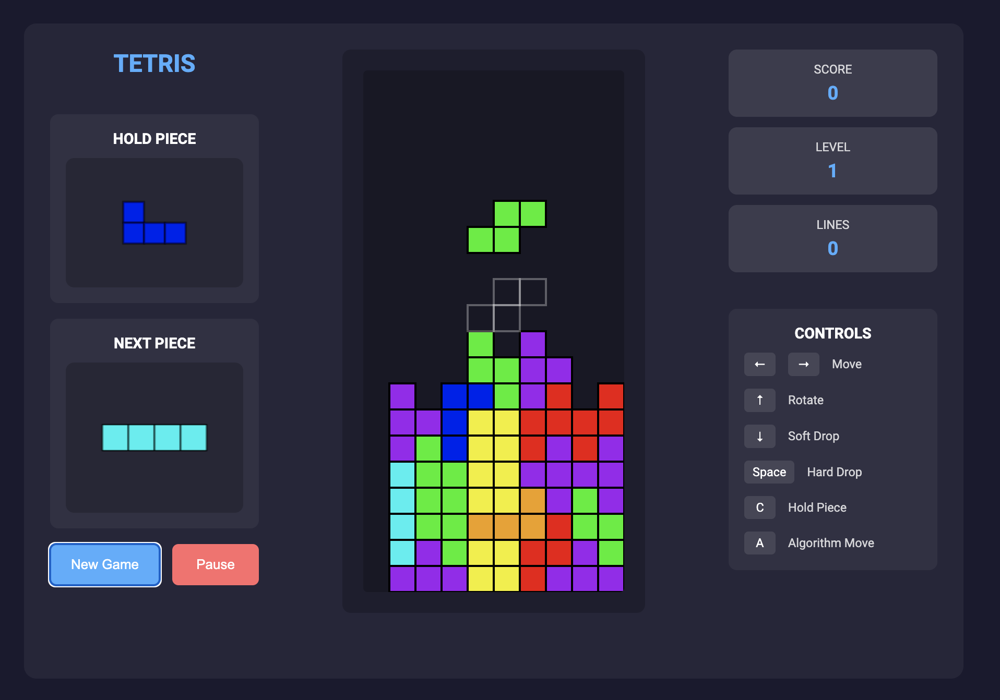

# Tetris Web Application

A modern, responsive web-based Tetris game built with Python Flask and HTML5 Canvas.

 *(Screenshot will be added when available)*

## Features

- Classic Tetris gameplay
- Responsive design that works on both desktop and mobile devices
- Modern UI with glass-morphism effects
- Score tracking system
- Increasing difficulty levels
- Next piece preview
- High DPI display support

## Prerequisites

Before you begin, ensure you have the following installed:
- Python 3.6 or higher
- pip (Python package installer)

## Installation

1. Clone the repository or download the source code:
   ```bash
   git clone <repository-url>
   cd tetris
   ```

2. Create a virtual environment (recommended):
   ```bash
   # On macOS/Linux
   python3 -m venv venv
   source venv/bin/activate

   # On Windows
   python -m venv venv
   .\venv\Scripts\activate
   ```

3. Install the required dependencies:
   ```bash
   pip install -r requirements.txt
   ```

## Running the Application

1. Make sure your virtual environment is activated (if you created one)

2. Start the Flask server:
   ```bash
   python app.py
   ```

3. Open your web browser and navigate to:
   ```
   http://localhost:5000
   ```

## How to Play

- Use the **Left** and **Right** arrow keys to move the piece horizontally
- Use the **Up** arrow key to rotate the piece
- Use the **Down** arrow key for soft drop (faster descent)
- Press the **Spacebar** for hard drop (immediate placement)
- Click the **New Game** button to start a new game
- Click the **Pause** button to pause/resume the game

## Game Rules

- Lines are cleared when they are completely filled with blocks
- Score points by clearing lines and placing pieces
- The game speeds up as you progress through levels
- Game ends when pieces reach the top of the board

## Project Structure

```
tetris/
├── app.py              # Flask application server
├── requirements.txt    # Python dependencies
├── README.md          # This file
├── static/
│   ├── css/
│   │   └── style.css  # Game styling
│   └── js/
│       └── tetris.js  # Game logic
└── templates/
    └── index.html     # Game interface
```

## Technical Details

- Frontend: HTML5, CSS3, JavaScript
- Backend: Python Flask
- Rendering: HTML5 Canvas
- Styling: Modern CSS with Flexbox and CSS Grid
- Dependencies: Flask, Flask-CORS

## Contributing

Feel free to fork the repository and submit pull requests for any improvements you'd like to make.

## License

This project is open source and available under the MIT License.

## Acknowledgments

- Built using Flask web framework
- Inspired by the classic Tetris game
- Modern UI design principles
