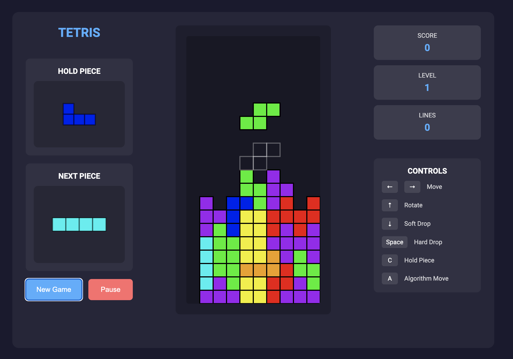

# Tetris

A modern, responsive web-based Tetris game built with Python Flask and HTML5 Canvas.



## Preface

I did not write a single line of this code - this project was completed exclusively using Windsurf by Codeium. A log of my prompts can be found in prompts.txt.

## Features

- Classic Tetris gameplay, including hold piece functionality
- Score tracking system
- Next piece preview
- Pause/play functionality
- Piece placement algorithm that can assist with gameplay

## Prerequisites

Before you begin, ensure you have the following installed:

- Python 3.6 or higher
- pip (Python package installer)
- Node.js and npm (for running tests)

## Installation

1. Clone the repository or download the source code:

   ```bash
   git clone <repository-url>
   cd tetris
   ```

2. Create a virtual environment (recommended):

   ```bash
   # On macOS/Linux
   python3 -m venv venv
   source venv/bin/activate

   # On Windows
   python -m venv venv
   .\venv\Scripts\activate
   ```

3. Install the required dependencies:
   ```bash
   pip install -r requirements.txt
   ```

## Running the Application

1. Make sure your virtual environment is activated (if you created one)

2. Start the Flask server:

   ```bash
   python app.py
   ```

3. Open your web browser and navigate to:
   ```
   http://localhost:5000
   ```

## Running Tests

1. Install Node.js dependencies:

   ```bash
   npm install
   ```

2. Run the test suite:
   ```bash
   npm test
   ```

The test suite covers:

- Line clearing and scoring
- Collision detection
- Game over conditions
- Hold piece mechanics
- Piece movement and rotation
- Level progression

## How to Play

### Controls

All keys can be held down for continuous action.

| Action     | Key           |
| ---------- | ------------- |
| Move Left  | ← Left Arrow  |
| Move Right | → Right Arrow |
| Rotate     | ↑ Up Arrow    |
| Soft Drop  | ↓ Down Arrow  |
| Hard Drop  | Spacebar      |
| Hold Piece | C or Shift    |
| Algorithm  | A             |

### Buttons

- **New Game** - Start a fresh game
- **Pause/Play** - Toggle game pause

## Algorithm Assistant

The game includes a piece placement algorithm that can help you during gameplay. Press the 'A' key to let the algorithm decide the optimal position for your current piece.

Alternatively, you can hold down the 'A' key to watch the algorithm play moves in rapid succession, effectively letting it play the game automatically.

In deciding the optimal move, the algorithm:

- Evaluates multiple possible positions and rotations
- Considers factors like:
  - Height differences between columns
  - Number of holes created
  - Overall stack height
- Automatically moves and rotates the piece to its chosen position

## Game Rules

### Scoring System

| Lines Cleared | Points (× Level) |
| ------------- | ---------------- |
| Single        | 40               |
| Double        | 100              |
| Triple        | 300              |
| Tetris (4)    | 1200             |

### Level Progression

- Level increases every 10 lines cleared
- Game speed increases with each level

### Game Over

- Game ends when a new piece can't be placed
- Final score is displayed

### Hold Piece System

- Store one piece for later use
- Hold slot becomes available again after placing a piece

## Project Structure

```
tetris/
├── app.py              # Flask application server
├── requirements.txt    # Python dependencies
├── package.json        # Node.js dependencies
├── README.md          # This file
├── static/
│   ├── css/
│   │   └── style.css  # Game styling
│   └── js/
│       └── tetris.js  # Game logic
├── templates/
│   └── index.html     # Game interface
└── tests/
    └── tetris.test.js # Game unit tests
```

## Technical Details

- Frontend: HTML5, CSS3, JavaScript
- Backend: Python Flask
- Rendering: HTML5 Canvas
- Styling: Modern CSS with Flexbox and CSS Grid
- Dependencies: Flask, Flask-CORS
- Testing: Jest

## Contributing

Feel free to fork the repository and submit pull requests for any improvements you'd like to make.

## Google Drive Link

[here]
